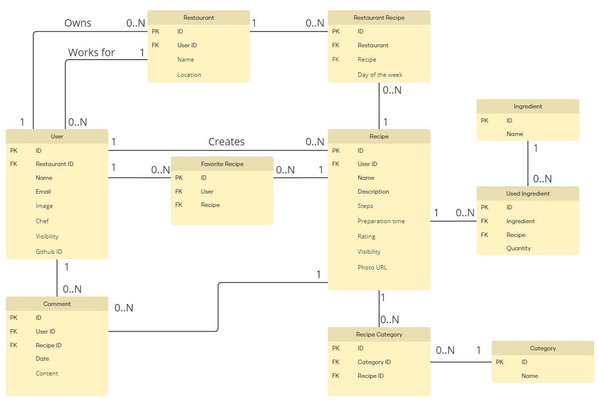

# FlavorShare

FlavorShare is a recipe sharing platform where users can create, share, and discover recipes. Users can also rate recipes, comment on them, and mark their favorite recipes. Chefs can manage their restaurant's recipes and visibility.

## Hosting

App is hosted at [Vercel](https://flavor-share-ten.vercel.app/)

## Technical Overview

FlavorShare is built using the following technologies:

- **Frontend**: Next.js, a React framework for server-side rendering and static site generation.
- **Backend**: Drizzle ORM for database interactions with SQLite as the database engine.
- **Authentication**: NextAuth.js for user authentication and session management.

### Database Overview

FlavorShare uses SQLite as the database engine, hosted at Turso. The database schema includes the following tables:

- **Users**: Stores user information including authentication details.
- **Recipes**: Stores recipe details created by users.
- **Ingredients**: Stores ingredient details.
- **Restaurants**: Stores restaurant details, linked to users.
- **RestaurantRecipes**: Links recipes to restaurants with a schedule.
- **Comments**: Stores user comments on recipes.
- **Ratings**: Stores user ratings for recipes.
- **FavoriteRecipes**: Stores user favorite recipes.

The database also contains custom triggers for updating the average recipe rating and cascade deletes.